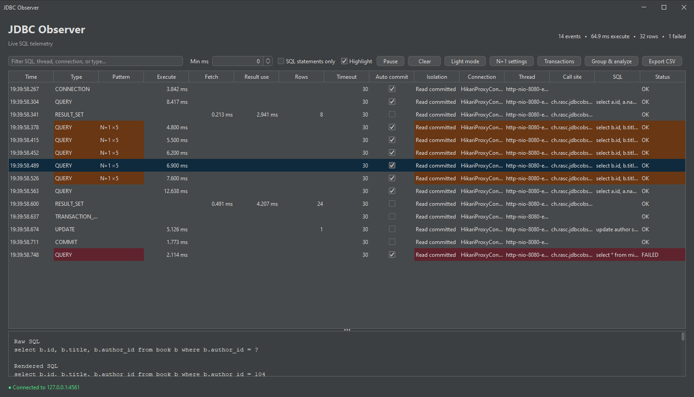

# JDBC Observer

A modern, zero-configuration Java 25 agent and Swing console for live JDBC SQL telemetry. It instruments JDBC drivers and data sources directly with the standard Java Class-File API, so applications keep their real JDBC URL, driver, and pool configuration without an instrumentation framework or proxy driver.



## Build and run

```shell
./mvnw clean package
java -jar observer-ui/target/observer-ui.jar
java -javaagent:observer-agent/target/observer-agent.jar -jar your-application.jar
```

On Windows, use `mvnw.cmd` instead of `./mvnw`. The repository includes the Maven
Wrapper and requires JDK 25; a separate Maven installation is not required.

The agent and UI communicate over loopback port `4561`. Choose another port with `-javaagent:...jar=port=9001` and launch the UI with `--port=9001`.

Normally the UI connects to the agent. Reverse the direction when firewall or container topology requires it:

```shell
java -jar observer-ui/target/observer-ui.jar --listen --port=4561
java -javaagent:observer-agent/target/observer-agent.jar=mode=client,host=127.0.0.1,port=4561 -jar your-application.jar
```

## Captured operations

- `Driver`, `DataSource`, pooled, XA-backed, and `ConnectionBuilder` connections with URL, redacted properties, and creation timing
- statements, prepared statements, callable statements, setter method names, rendered parameters, and batches
- query, update, large-update, generic execute, generated keys, commit, rollback, timing, row counts, and SQL failures
- separate execution, result-set fetch, and total result-set usage timing
- query timeout, autocommit state, and transaction isolation at execution time
- normalized SQL fingerprints, application call-site attribution, and thresholded stack traces
- classification of redundant SQL, N+1 reads, and writes that should use JDBC batching
- conservative Cartesian-product detection for explicit `CROSS JOIN` and unconstrained comma joins
- transaction timelines with statements, savepoints, commits, rollbacks, isolation changes, and autocommit transitions
- all current JDBC interfaces from the Java 25 platform (JDBC 4.3)

The UI provides filtering/highlighting, minimum-duration filtering, a SQL-statements-only view, correctly typed sorting, pause/resume, per-event details, on-demand execution plans, grouped cumulative SQL analysis, connection metadata, aggregate metrics, bounded batch ingestion, bounded history, light/dark styling, complete asynchronous CSV export, and runtime SQL throttling. Pause and Clear stay available in the command bar; on narrower windows, the minimum-duration control collapses into the **Filters** popup. SQL-only filtering, highlighting, and auto-scroll are available from the **View** menu. Set the history limit with `-DmaxLoggedStatements=50000` (the default is 20,000). Pausing intentionally discards incoming events until capture is resumed.

Agent server mode binds only to loopback and accepts one active UI at a time; a newer UI connection replaces the previous one. UI listener mode intentionally opens the configured local port and should be exposed only on trusted networks. The protocol is unencrypted and unauthenticated. SQL and bound values can contain sensitive application data, so do not send telemetry over an untrusted network. Connection property and URL keys commonly used for passwords, secrets, credentials, and tokens are redacted.

Each agent process has a unique session identity. The UI retains events across reconnects to the same process and starts a fresh history when a different agent connects, preventing event and transaction ID collisions.

### Call sites and repeated SQL detection

The agent records the first non-JDK application stack frame for SQL operations. Failed statements and statements taking at least 100 ms also include up to 32 application frames. Configure this in the agent argument:

```shell
-javaagent:observer-agent.jar=stackTraceThresholdMs=250
-javaagent:observer-agent.jar=stackTrace=off
```

The UI classifies a repeated normalized SQL fingerprint after at least five executions within one second by the
same call site, thread, connection, and, when present, explicit transaction:

- `Redundant` when every execution uses the same bound values or concrete SQL
- `N+1` when a read repeats with different bound values or literal SQL
- `Batch candidate` when a non-batched write repeats with different bound values or literal SQL

Actual JDBC batch executions are excluded. Use **Settings > Repeated SQL detection** to change the threshold and
window at runtime; retained events are re-evaluated immediately. System properties set the startup defaults:

```shell
java -DjdbcObserver.repetitionThreshold=10 -DjdbcObserver.repetitionWindowMillis=2000 -jar observer-ui.jar
```

The previous `jdbcObserver.nPlusOneThreshold` and `jdbcObserver.nPlusOneWindowMillis` property names remain
supported as fallbacks.

### Cartesian-product detection

The UI marks definite Cartesian-product syntax in the **Pattern** column. It detects explicit `CROSS JOIN`
operators and simple comma-separated `FROM` lists that have no `WHERE` clause at the same query level. The
analysis ignores comments, string literals, quoted identifiers, function arguments, and comma joins constrained
by a `WHERE` clause.

This is intentionally a conservative syntax warning. JDBC row counts do not reveal the expected cardinality, so
large result sets and complex joins are not guessed to be Cartesian products. Intentional cross joins are still
marked and should be reviewed rather than assumed to be defects.

### Theme

Use **View > Dark mode** to switch themes at runtime. Light mode is the default; start directly in dark mode with:

```shell
java -DjdbcObserver.darkMode=true -jar observer-ui.jar
```

### SQL throttling

Use **Settings > Throttler** to add an artificial delay before each observed query, update, execute call, or batch. The delay is included in the reported execution duration. The dialog and **Settings > Clear throttler** can both clear the delay. While configured, the footer shows the delay and whether it is active on a connected agent or waiting to be applied. The agent automatically clears throttling when the UI control connection closes.

### Execution plans

Select a query, update, or generic execute event and choose **Analyze > Explain selected SQL** (or press `Ctrl+E`) to request its execution plan. The agent uses the matching live JDBC connection when it is still open, or borrows a replacement from the originating data source after a pooled connection has been returned. It runs plain `EXPLAIN`, never `EXPLAIN ANALYZE`, so the selected statement is not executed. For safety, EXPLAIN requests accept one statement, time out after 10 seconds when the driver supports query timeouts, and cap returned output.

### Transaction timelines

Open **Analyze > Transactions** to inspect retained explicit transactions as ordered timelines. Active transactions update once per second. The view highlights transactions whose total duration or current idle time exceeds the configured threshold; both thresholds can be changed directly in the timeline window.

Startup defaults are configurable with:

```shell
java -DjdbcObserver.longTransactionMillis=5000 \
     -DjdbcObserver.idleTransactionMillis=2000 \
     -jar observer-ui.jar
```

The historical source remains under `old/` for reference and is not part of the new Maven reactor.

## Development tasks

Install [Task](https://taskfile.dev/) to use the cross-platform commands in
[`Taskfile.yml`](Taskfile.yml):

```shell
task                 # list available tasks
task format          # apply Spring Java Format
task test            # run all tests
task verify          # run the same verification used by CI
task package         # build all artifacts
task ui              # build and start the Swing UI
task demo-up         # build and start the Docker demo
task demo-down       # stop the Docker demo
```

## Continuous integration and releases

GitHub Actions runs the complete Java 25 Maven verification build for every pull
request and every branch push.

Pushing a tag whose name starts with `v` builds and tests the project, creates a
GitHub release with automatically generated release notes, and attaches the two
runnable jars:

- `observer-agent.jar`
- `observer-ui.jar`

For example:

```shell
git tag v1.0.0
git push origin v1.0.0
```

The release workflow uses the repository's built-in `GITHUB_TOKEN`; no release
secret is required. Ensure **Settings → Actions → General → Workflow permissions**
allows workflows to read and write repository contents.

## Spring Data JPA and PostgreSQL demo

[`observer-demo`](observer-demo/README.md) contains a Java 25 Spring Boot 4.1 application using Spring Data JPA, Hibernate, and PostgreSQL 18 Alpine. Its Docker Compose stack starts the application with the observer agent attached and provides intentional N+1 and optimized `@EntityGraph` endpoints for comparison.
